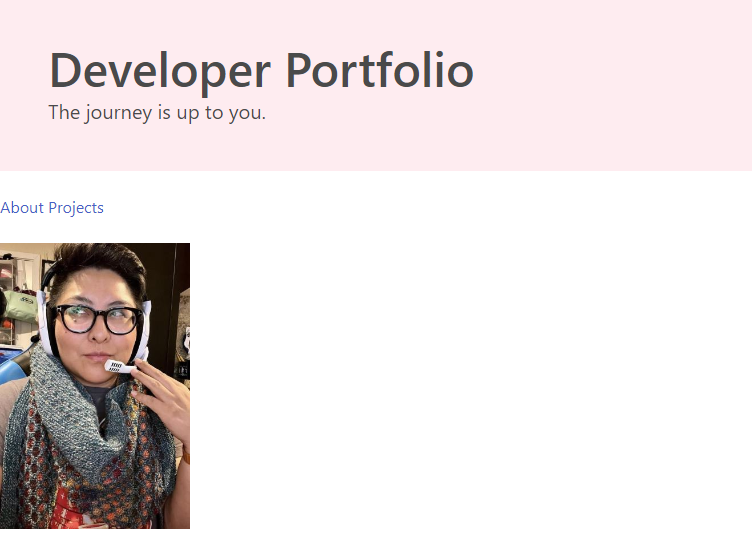

# Developer Portfolio: Christy G. Hanson

## URLs

* [GitHub Remote Repo](https://github.com/ChristyGHanson/christyghanson-web-portfolio)
* [Deployed Portfolio Website](https://christyghanson.github.io/christyghanson-web-portfolio/)

## Description

This is my web developer portfolio I am building from scratch. I will be updating it as my UW Bootcamp course progresses.

This portfolio of work will showcase my skills and talents to future employers.

I am applying these core skills:

* Bulma
* Flexbox
* Font Awesome
* media queries
* HTML, CSS, and JavaScript

## User Story
Employers want to view a potential employee's deployed portfolio of work samples so that they can review samples of their work and assess whether they're a good candidate for an open position.

## Acceptance Criteria

GIVEN I need to sample a potential employee's previous work...

* Finished: I enclosed my name, a recent photo, and links to sections about them, Linkedin, and how to contact me.

* Finished: I used anchor tags to make the UI scroll to the corresponding section on the page.

* Finished: I linked my JS file into the index.html file.

* Finished: I added HTML semantic tags to the index.html file for accessibility.

## Unfulfilled Criteria

* WHEN I click on the link to the section about their work
THEN the UI scrolls to a section with titled images of the developer's applications

* WHEN I am presented with the developer's first application
THEN that application's image should be larger in size than the others

* WHEN I click on the images of the applications
THEN I am taken to that deployed application

* WHEN I resize the page or view the site on various screens and devices
THEN I am presented with a responsive layout that adapts to my viewport

